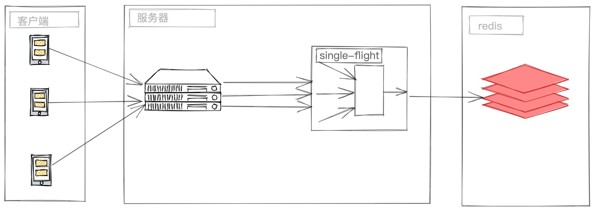

## about single-flight 
Single-flight is an engine provides a duplicate function call suppression mechanism implements by golang.

single-flight architecture



## get started 

```shell script
go get github.com/laxiaohong/singlefight
```

## usage

```go
package main

import (
	"context"
	"fmt"
	"github.com/gin-contrib/pprof"
	"github.com/gin-gonic/gin"
	"github.com/go-redis/redis/v8"
	"github.com/laxiaohong/singleflight"
)

var (
	cli    *redis.Client       = nil
	group  *singleflight.Group = singleflight.NewGroup()
	engine *gin.Engine         = gin.Default()
)

const (
	key string = "hello_world"
	val string = "你好世界"
)

func init() {
	cli = redis.NewClient(&redis.Options{
		Addr: "127.0.0.1:6379",
	})

	// ...
	if err := cli.Ping(context.TODO()).Err(); err != nil {
		panic(err)
	}
	cli.Set(context.TODO(), key, val, 0)
}

func fetchValueFromDataSource(cli *redis.Client,
	key string) func() (value interface{}, err error) {
	return func() (value interface{}, err error) {
		return cli.Get(context.TODO(), key).Result()
	}
}

func main() {
	pprof.Register(engine)
	engine.GET("/single_flight", func(ctx *gin.Context) {

		value, err := group.DoCall(fmt.Sprintf("%s", key), fetchValueFromDataSource(cli, key))
		ctx.JSON(200, gin.H{"res": value, "error": err})
	})
	if err := engine.Run(":8080"); err != nil {
		_ = fmt.Errorf("error %s", err)
	}
}

```

